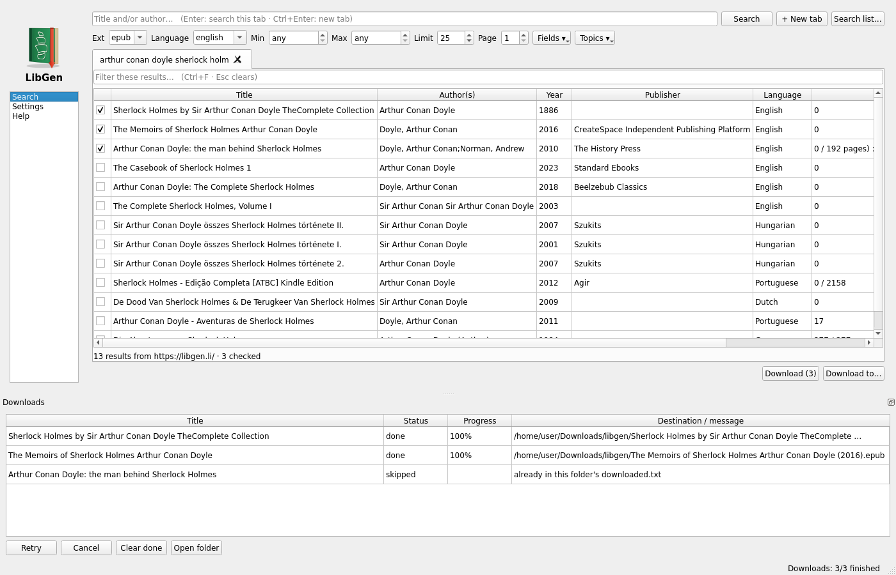

#  LibGen desktop app

A small desktop client for searching Library Genesis mirrors and downloading books.
One Python file plus a stdlib-only search backend. No Node, no browser automation.



## Features

- Search by title / author across the mirrors' own field and topic filters, with
  extension, language, size and result-limit filters. Results are paginated
  automatically, so a limit of 500 really returns 500 rows.
- Tabbed results with a quick filter, sortable columns, multi-select, and a
  details popup with the full record and cover.
- Batch search from a text file (one query per line, one tab per query).
- Download queue with retry, cancel, per-item progress and automatic mirror
  fallback. Every file is verified against its MD5; corrupt downloads are
  rejected and retried. Books already downloaded into a folder are skipped.
- Configurable file naming (`{NAME} ({YEAR})`, `{FIRST_AUTHOR}`, ...).
- Session restore: open tabs and the queue come back on the next start.
- Light or dark theme (Settings > Appearance).
- `lgsearch.py` doubles as a CLI: `python3 lgsearch.py "terry pratchett" --ext epub --table`.

## Option 1: run directly with Python

No build needed. Requires Python 3.9+ and PyQt5; the script and `lgsearch.py`
just need to sit in the same folder.

```
pip install pyqt5
python3 libgen_app.py        # Windows: python libgen_app.py
```

Settings and session files are written next to `libgen_app.py` (or next to the
built binary; on macOS the `.app` uses `~/Library/Application Support/LibGen`, so it can live in `/Applications`). Downloads go to `~/Downloads/libgen` by default; change it in Settings.

## Option 2: build a standalone binary

PyInstaller cannot cross-compile, so run each script on its own platform. Each
installs `pyqt5` and `pyinstaller` into the Python on your PATH; use a venv if
you don't want that.

| Platform | Script | Output |
|---|---|---|
| Windows | `build_exe.bat` | `dist\LibGen.exe` |
| Linux | `build_linux.sh` (`--no-install` to skip the `~/.local` install + menu entry) | `dist/libgen` |
| macOS | `build_mac.sh` | `dist/LibGen.app` (untested; drag to `/Applications`; first launch via right-click > Open) |

On Linux/macOS run the script from its folder in a terminal (`chmod +x` first if the
executable bit was lost in transit, e.g. after a zip or email):

```
chmod +x build_mac.sh && ./build_mac.sh
```

## Checks

```
python3 libgen_app.py --selftest                            # pure functions, no PyQt5 needed
QT_QPA_PLATFORM=offscreen python3 libgen_app.py --smoke     # headless: real search + one download
```

## Disclaimer

This project is independent and not affiliated with, endorsed by, or connected to
Library Genesis or any of its mirrors. It is a client only: it hosts no content and
connects to public mirrors whose availability changes. Make sure downloading a given work is legal where you are.

## License

MIT, see `LICENSE`.
